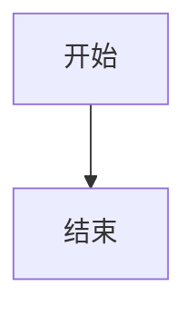

### HDFS架构
HDFS采用的是Master/Slave架构, 一个HDFS集群包含一个NameNode, 一个SecondaryNode和多个DataNode节点

```mermaid
graph TD
开始 --> 结束
```

##### NameNode
NameNode负责管理整个分布式系统的元数据, 主要包括: 
 - 目录树结构
 - 文件到数据库block的映射关系
 - 
