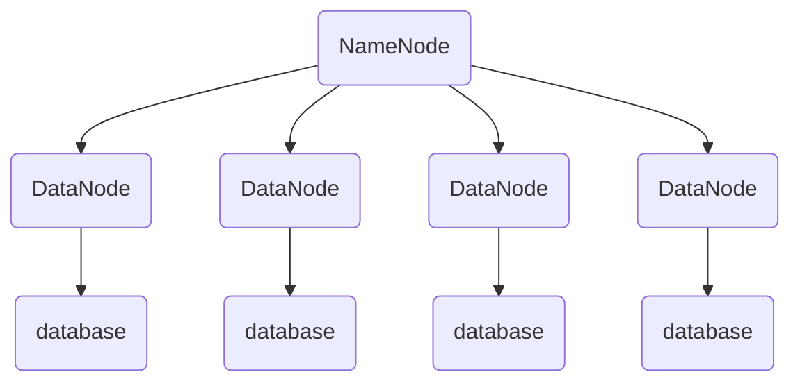

### HDFS架构
HDFS采用的是Master/Slave架构, 一个HDFS集群包含一个NameNode, 一个SecondaryNameNode和多个DataNode节点

##### Block:
block是HDFS中最基本的存储单位, HDFS上的文件使用block来存储的原因: 
 - 大文件用一个节点存不下来, 势必分成块
 - 网络传输时, 如果宕掉, 可以小部分重传
 - 简化了存储管理, 同时元数据就不需要和块一同存储了, 用一个单独的系统就可以管理这些块的元数据

##### NameNode
NameNode负责管理整个分布式系统的元数据, 主要包括: 
 - 目录树结构
 - 文件到数据库block的映射关系(文件和block的对应关系)
 - 

##### Secondary NameNode
Secondary NameNode不是NameNode的热备机, 而是定期从NameNode拉取fsimage和editlog文件, 
并对两个文件进行合并, 形成新的fsimage文件并传回NameNode, 减轻NameNode工作压力

##### DataNode
负责数据块的实际存储和读写工作, Block默认是64MB(HDFS2.0改成了128MB), 当一个客户端上传一个大文件时, 
HDFS会自动将其切割成固定大小的Block, 每个Block默认有3个备份

------

### HDFS2.0
HDFS2.0中一个集群中有两个NameNode, 两台NameNode形成互备, 一台处于Active状态, 一台处于Standby状态, 
一旦主NameNode出现故障, 可以迅速切换到备用NameNode
