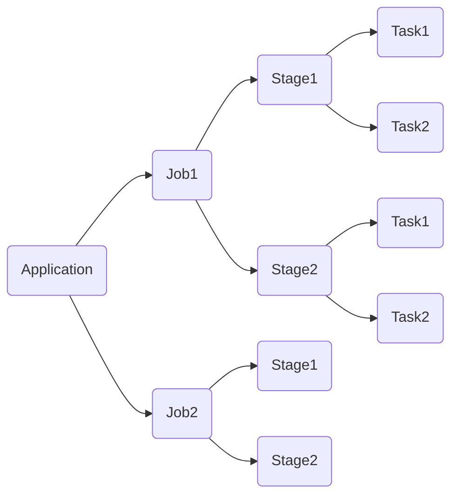

### Spark中Job-Stage-Task之间的关系

**Job**: 一个Spark程序可以被划分为一个或多个Job, 划分的依据是RDD的Action算子, 
每遇到一个RDD的Action操作, 就生成一个新的job

**Stage**: 每个job在具体执行过程中遇到shuffle, 便划分一个新的Stage

**Task**: 一般RDD的一个partition对应一个task, 这些task执行相同的程序逻辑, 只是处理的数据不同

引用: https://www.jianshu.com/p/3aa52ee3a802

