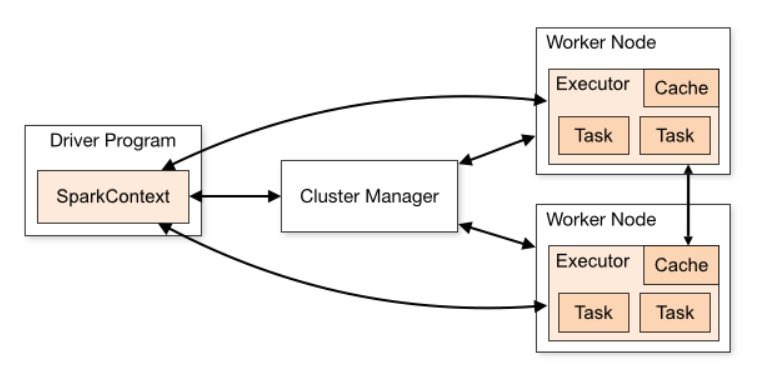
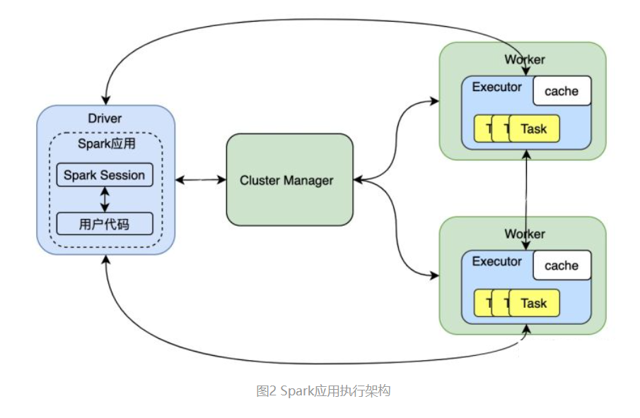

### Spark架构

Spark应用执行的基本架构图, 其中浅绿色的方块是资源管理框架的服务, 和Yarn的对应关系: 
Resource Manager(YARN)  -->  Cluster Manager
Node Manager(YARN)  -->  Worker
这些服务在Spark应用程序提交和执行之前就一直处于运行状态, Spark应用运行在资源管理平台之上, 
当执行Spark应用程序时, 会向资源管理器(Cluster Manager)申请运行资源

- Cluster Manager: Master主节点, 控制整个集群, 监控Worker, (在YARN中为资源管理器)
- Worker节点: 从节点, 负责控制计算节点, 启动Executor或者Driver
- Driver: 运行Application的main()函数
- Executor: 执行器, 是为某个Application运行在worker node上的一个进程

