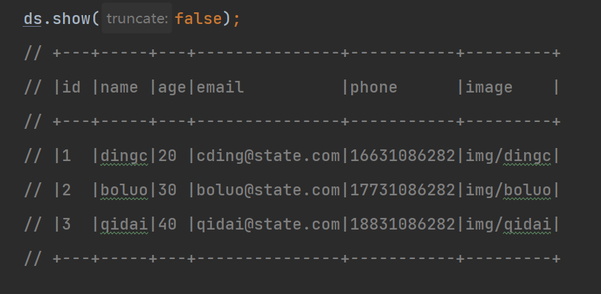
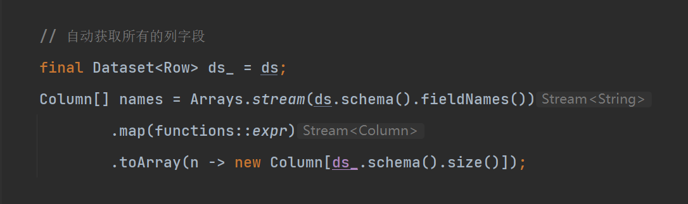
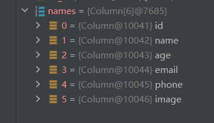
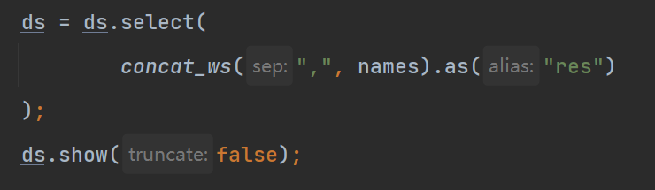
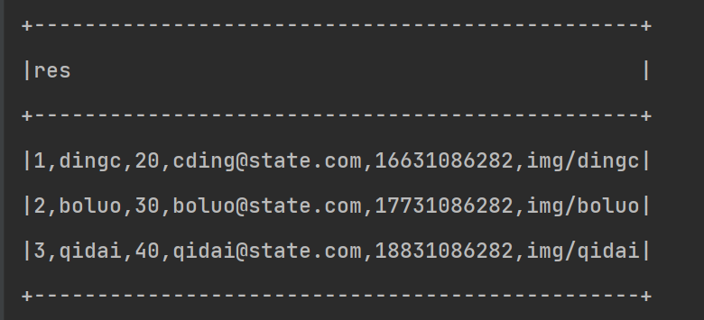

## 将多列字段合并为一列

- Java版本: https://github.com/Daytime-Don-t-Know-Dark-Night/parent/blob/main/basic/src/main/java/boluo/spark/Demo1.java
- Scala版本: https://github.com/Daytime-Don-t-Know-Dark-Night/parent/blob/main/scala/src/main/scala/boluo/spark/Demo1.scala
- 使用函数参考文档: https://spark.apache.org/docs/2.4.3/api/sql/index.html#concat

下面详解使用Java版本

### 1. 准备RDD数据

### 2.获取所有列字段的字段名

经过此步可将所有的列名取出, 如下图: 

### 3.使用concat_ws()函数, 将各列拼接成为一列, 此处使用英文逗号分割

### 4.结果如图

### 5.总结

大多数拼接参数都需要传入所有要拼接的列名, 所以步骤分为:
1. 求出所有要拼接的列名 
2. 将这些列名传入函数进行拼接

